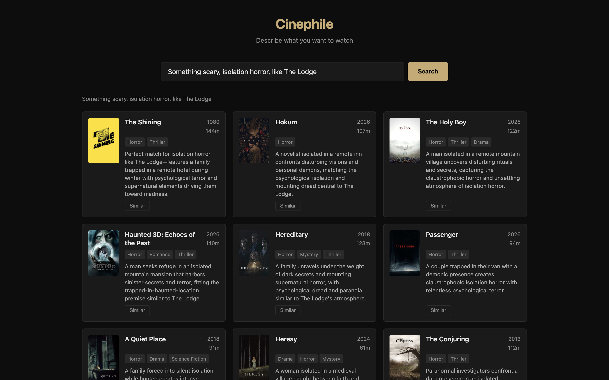

# Cinephile

> Conversational movie recommendation via semantic search, RAG, and a bounded LangGraph agent.


Describe what you're in the mood for in plain language — *"something dark and philosophical but not too slow"* — and Cinephile retrieves semantically similar films, then uses an LLM to rank them and explain exactly why each one fits your request.



---

## How it works

The system separates **retrieval** (vector search) from **generation** (LLM). The LLM never sees the full catalog — only the top-k candidates the vector store retrieved for a given query. This keeps generation grounded (it can only recommend films that actually exist), cheap (a few hundred tokens per call), and honest (no hallucinated titles).

```
query ──embed──► Qdrant vector search ──► top-k candidates ──► LLM rank + explain ──► results
                       │                                               │
                 payload filters                           (API down) ──► vector ranking (degraded)
```

For multi-constraint queries (*"like Berserk but a film, Kurosawa-influenced, under two hours"*), a bounded LangGraph agent sits in front: it decomposes the request, retrieves against each part, and re-queries at most once. Simple queries skip the agent entirely and take the fast linear path.

---

## Quick start

**Prerequisites:** Docker Desktop, Python 3.11+, a free [TMDB API key](https://www.themoviedb.org/settings/api), and an [Anthropic API key](https://console.anthropic.com).

```bash
# 1. Clone and configure
git clone <repo-url> cinephile
cd cinephile
cp .env.example .env
# Edit .env — add ANTHROPIC_API_KEY and TMDB_API_KEY

# 2. Start services (Qdrant + backend + frontend)
docker compose up

# 3. Ingest movie data (run once; ~10 min for 3 000 movies)
python backend/scripts/ingest.py --count 3000

# 4. Open the app
open http://localhost:5173
```

The system works without `ANTHROPIC_API_KEY` — it returns vector-ranked results and marks the response `degraded: true`. Useful for testing retrieval without burning API credits.

---

## Project structure

```
cinephile/
├── docker-compose.yml          # One-command bring-up: Qdrant + backend + frontend
├── .env.example                # Config template — copy to .env, fill in keys
├── backend/
│   ├── pyproject.toml          # Python deps (FastAPI, Qdrant, FastEmbed, Anthropic, LangGraph)
│   ├── Dockerfile
│   ├── app/
│   │   ├── config.py           # pydantic-settings; all config from environment
│   │   ├── models.py           # Pydantic request/response schemas
│   │   ├── embeddings.py       # FastEmbed wrapper — loads model once at startup
│   │   ├── retrieval.py        # Qdrant vector search + payload filters
│   │   ├── generation.py       # Anthropic SDK: rank + explain, strict JSON output
│   │   ├── eval.py             # Retrieval eval harness (recall@k)
│   │   ├── routes/
│   │   │   ├── recommend.py    # POST /recommend
│   │   │   ├── similar.py      # GET /similar/{movie_id}
│   │   │   └── health.py       # GET /health
│   │   └── agent/
│   │       ├── router.py       # Logical routing: simple vs. multi-constraint
│   │       ├── graph.py        # LangGraph state machine (hard cap: 2 retrieval rounds)
│   │       └── tools.py        # Fixed toolset: theme search, metadata search, filter
│   └── scripts/
│       └── ingest.py           # TMDB pull → embed → Qdrant upsert
└── frontend/
    ├── Dockerfile
    └── src/
        ├── App.jsx
        ├── api.js
        └── components/MovieCard.jsx
```

---

## API reference

### `POST /recommend`

The main endpoint. Accepts a natural-language query and optional structured filters.

**Request body:**
```json
{
  "query": "something dark and philosophical but not too slow",
  "k": 10,
  "filters": {
    "year_min": 1990,
    "year_max": 2023,
    "runtime_max": 150,
    "genres_include": ["Drama", "Thriller"],
    "genres_exclude": ["Horror"]
  }
}
```

| Field | Type | Default | Description |
|---|---|---|---|
| `query` | string | required | Natural-language description of what you want |
| `k` | int | 10 | Number of results (1–50) |
| `filters.year_min` | int \| null | null | Earliest release year |
| `filters.year_max` | int \| null | null | Latest release year |
| `filters.runtime_max` | int \| null | null | Maximum runtime in minutes |
| `filters.genres_include` | string[] | [] | At least one of these genres must match |
| `filters.genres_exclude` | string[] | [] | None of these genres may be present |

**Response:**
```json
{
  "query": "something dark and philosophical but not too slow",
  "degraded": false,
  "results": [
    {
      "tmdb_id": 550,
      "title": "Fight Club",
      "year": 1999,
      "genres": ["Drama", "Thriller"],
      "overview": "A ticking-time-bomb insomniac...",
      "runtime": 139,
      "poster_path": "/bptfVGEQuv6vDTIMVCHjJ9Dz8PX.jpg",
      "reason": "A pitch-dark meditation on identity and consumer society that moves at a relentless pace — exactly the philosophical intensity you're after without feeling slow."
    }
  ]
}
```

`degraded: true` means the LLM step failed (API key missing or network error) and results are sorted by raw vector similarity instead.

---

### `GET /similar/{movie_id}`

Returns films semantically similar to a given TMDB movie ID. Useful for "more like this."

```bash
curl http://localhost:8088/similar/550?k=5
```

---

### `GET /health`

Returns Qdrant connectivity and collection status.

```json
{ "status": "ok", "qdrant": "ok", "collection": "movies" }
```

---

## Configuration

All settings are read from environment variables (via `backend/app/config.py`). The important ones:

| Variable | Default | Description |
|---|---|---|
| `ANTHROPIC_API_KEY` | `""` | Anthropic API key. Without it, the system runs in degraded mode. |
| `TMDB_API_KEY` | `""` | Required only for `scripts/ingest.py`. |
| `QDRANT_URL` | `http://localhost:6333` | Qdrant endpoint. In Docker Compose, use `http://qdrant:6333`. |
| `QDRANT_COLLECTION` | `movies` | Qdrant collection name. |
| `EMBED_MODEL` | `BAAI/bge-small-en-v1.5` | FastEmbed model name. |
| `EMBED_DIM` | `384` | Must match the model's output dimension. |
| `DEFAULT_K` | `15` | Number of candidates fetched before LLM ranking. |
| `LLM_MODEL` | `claude-haiku-4-5-20251001` | Anthropic model for rank + explain. |

---

## Running the retrieval eval

A hand-built eval harness measures recall@k across 18 test queries covering genre, mood, and style.

```bash
# From the repo root, with Qdrant running and the collection populated:
docker compose up -d qdrant
cd backend
python -m app.eval        # recall@10
python -m app.eval 5      # recall@5
```

Sample output:
```
Retrieval Eval — recall@10
==================================================
Query                                              recall@10
----------------------------------------------------------
dark psychological thriller about identity...           0.60
heartwarming animated family film                       0.80
epic science fiction space opera                        0.80
...
----------------------------------------------------------
Average                                                 0.64
```

This means "I'd add technique X if eval showed a recall gap" is grounded in an actual number, not a vibe.

---

## Adapting to other domains

The retrieval-generation pattern is domain-agnostic. To point it at a different catalog (books, papers, recipes, job listings):

1. **Replace `scripts/ingest.py`** — pull from your data source instead of TMDB and upsert to Qdrant with whatever payload fields matter.
2. **Adjust `build_doc()` in `ingest.py`** — compose the embedding document from your fields. The shape matters: richer text → better semantic recall.
3. **Update the generation prompt in `generation.py`** — swap "movie recommendation assistant" for your domain; keep the grounding constraint (candidates only, strict JSON out).
4. **Extend `models.py`** — add or remove filter fields on `Filters` to match your structured metadata.
5. **Update `retrieval.py`** — add `FieldCondition` entries for any new filterable fields.

The LangGraph agent in `app/agent/` is optional — the linear `POST /recommend` path works independently and is simpler to reason about.

---

## Key decisions

**Local embeddings, hosted LLM.** Embeddings run locally (FastEmbed, `bge-small-en-v1.5`): no per-query cost, no network dependency, no rate limits. Generation uses the Anthropic API (Claude Haiku 4.5) because explanation quality from a small local model isn't competitive, and Haiku is fast and cheap enough to call per request. Haiku over Sonnet because ranking a handful of candidates and writing short blurbs doesn't need a frontier model — swapping up is a one-line config change if quality demands it.

**Vector search for meaning, structured filters for facts.** The core feature — matching films to open-ended mood descriptions — is semantic similarity, which a relational `WHERE` clause can't express. But constraints like runtime and genre *are* structured, so those go through Qdrant payload filters, not vector math. The design combines both in a single query.

**Plots embedded whole, not chunked.** Movie overviews are a paragraph; chunking would fragment meaning and hurt retrieval. The right chunking strategy is document-dependent — this is the opposite call from long-document RAG.

**Qdrant in Docker, not a cloud vector store.** At a few thousand films with an LLM already in the request path, vector latency isn't the bottleneck. Qdrant in a container is free, sub-millisecond, and offline-reliable. Production decision tree if this scaled: S3 Vectors when cost dominates and latency is forgiving; Aurora pgvector to consolidate with relational metadata; OpenSearch only at high query volume.

**A bounded agentic path for hard queries — not for everything.** Simple single-hop queries take a fast linear path. Genuinely multi-constraint queries route into a LangGraph agent that decomposes the request, retrieves against each part, and re-queries at most once — hard cap of 2 rounds. This mirrors the documented production pattern: bound agents within specific action spaces and pre-determined retrieval steps rather than granting open autonomy. The agent earns its place on the queries that need it and stays out of the way on the ones that don't.

**Graceful degradation as a feature.** If the Anthropic call fails, the system falls back to raw vector-ranked results with a visible `degraded: true` flag. It serves queries even with the API key absent. Designing for the failure path, not just the happy path, is the difference between a notebook and a service.

---

## Deliberately out of scope

Evaluated and excluded — each adds latency and failure surface without earning its place against this workload:

- **HyDE** — queries and plot summaries already share embedding space; generating a hypothetical document adds cost without improving recall.
- **Multi-query / RAG-Fusion** — would be added in response to a measured recall gap, not by default.
- **Step-back prompting** — fits reasoning-heavy QA, not recommendation.
- **Cross-encoder reranking** — the LLM rank step covers this at current scale.
- **Semantic router** — the simple-vs-complex decision is about query *structure*, which the orchestrator's first reasoning step judges directly. Embedding-based routing would only help disambiguating multiple fuzzy intents or corpora.

The retrieval core is intentionally lean. That's not naive RAG — it's the result of knowing the alternatives and keeping only what the workload justifies.

---

## Stack

| Layer | Technology |
|---|---|
| API | FastAPI (async), Pydantic v2 |
| Vector store | Qdrant |
| Embeddings | FastEmbed — `BAAI/bge-small-en-v1.5` (384-dim, local) |
| LLM | Anthropic Claude Haiku 4.5 |
| Agent orchestration | LangGraph |
| Data source | TMDB API |
| Frontend | React 18 + Vite |
| Infra | Docker Compose |
